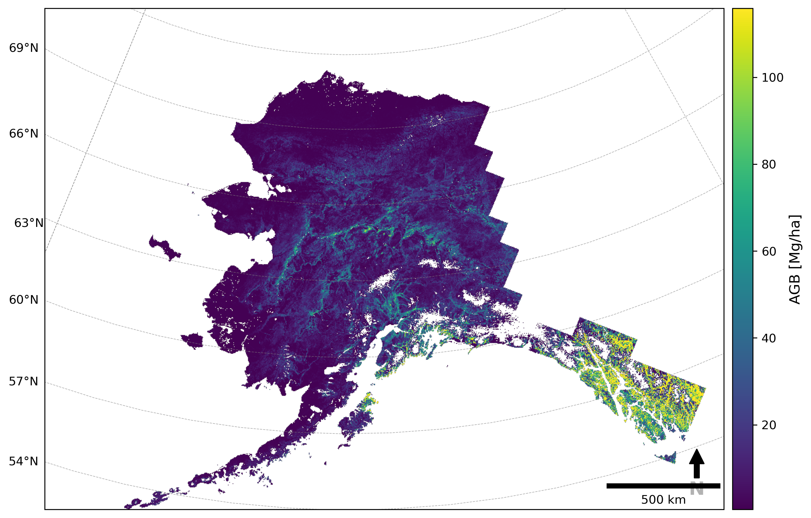

# boreal-unet-data-prep

Training-data extraction and inference pipeline for predicting boreal forest
canopy height and aboveground biomass (AGB) from HLS imagery, ICESat-2 ATL08
LiDAR, and topography, using a U-Net. Built to run at tile-by-tile scale, both
locally and as registered algorithms on NASA MAAP's DPS job runner.



## Pipeline stages

1. **`coincident_fire_atl08.py`** *(optional)* -- finds fire polygons that
   have both pre- and post-fire ATL08 LiDAR coverage, for building
   fire-disturbance training/validation sets. Not yet migrated to STAC (see
   below); still takes pre-resolved paths directly.
2. **`build_stac_catalog.py`** -- builds the STAC catalog every other script
   (except `coincident_fire_atl08.py`) reads assets from: joins the existing
   tindex CSVs (HLS composite, ATL08 labels, topo stack, land cover) to the
   canonical tile-grid GeoPackage, and writes a static catalog + a flattened
   GeoParquet items table. An occasionally-run bootstrap step, not part of
   the regular per-tile flow -- see its module docstring for the "why STAC,
   why static, why GeoParquet" rationale.
3. **`data_prep.py`** -- fuses HLS + ATL08 + topography into normalized,
   patch-extracted TFRecords for training, resolving assets by `tile_num`
   against the STAC catalog. Internally shells out to **`atl08_to_agb.R`**
   to convert ATL08 height metrics to AGB when `--agb` is passed.
4. **Model training** -- currently done in a Jupyter notebook that isn't
   checked into this repo yet (an updated version is coming).
5. **`predict.py`** / **`predict_all_years.py`** -- run a trained U-Net over
   a single HLS scene+year, or over every available year for a tile, also
   resolving HLS/topo/land-cover by `tile_num` against the STAC catalog.

Shared logic lives in `constants.py`, `raster_utils.py`, `atl08_utils.py`,
`patch_extraction.py`, `tfrecord_utils.py`, and `stac_search.py` (the
catalog query helper) -- `data_prep.py` and `predict.py` both import from
these rather than from each other. `stac_search.py` deliberately only
depends on `geopandas`, not on `build_stac_catalog.py`'s heavier
`pystac`/`stac-geoparquet`/`antimeridian` toolchain, so the per-tile
query path stays light.

## Setup

This repo uses **two conda environments**, split mainly because
training-data extraction needs R (for `atl08_to_agb.R`) and inference
doesn't. Both pull CUDA-enabled TensorFlow (`tensorflow[and-cuda]`) for
consistency, even though DPS's current predict workers are CPU-only --
`tensorflow[and-cuda]` falls back to CPU cleanly when no GPU is present, so
this keeps the two envs interchangeable and ready for a GPU predict worker
without an environment change:

| Env | Created from | Used by |
|---|---|---|
| `data_prep2` | `environment.yml` | `data_prep.py`, `build_stac_catalog.py` |
| `predict_env` | `environment-predict.yml` | `predict.py`, `predict_all_years.py`, `coincident_fire_atl08.py` |

`build_stac_catalog.py`'s extra dependencies (`pystac`, `stac-geoparquet`,
`antimeridian`) only live in `environment.yml`/`data_prep2` -- it's not
needed in `predict_env` since `stac_search.py` (what `predict.py`/
`predict_all_years.py` actually import) only needs `geopandas`.

```bash
conda env create -f environment.yml          # creates data_prep2
conda env create -f environment-predict.yml  # creates predict_env
# or, equivalently, for predict_env:
./build-env-predict.sh
```

GDAL/rasterio/geopandas are installed via conda-forge (not pip) so that
Python and R share one `libgdal` build -- see `pyproject.toml` for why its
`dependencies` list deliberately excludes GDAL and leaves versions unpinned.

### Local development (tests, linting)

Activate one of the conda envs above (either works; `pip` will pull in
whichever of `pyproject.toml`'s dependencies conda didn't already provide --
e.g. `predict_env` doesn't pin `pyarrow`), then install this repo as an
editable package with the `dev` extras:

```bash
conda activate data_prep2   # or predict_env
pip install -e ".[dev]"
```

```bash
pytest                # run the test suite
ruff format .          # apply formatting
ruff check .           # lint
```

## Running the pipeline

Every script can be run directly with `python`, or through its `run-*.sh`
wrapper, which activates the right conda env via `conda run` and is what the
DPS registration YAMLs (`register_*.yml`) invoke in production.

### 1. Find fire-coincident ATL08 tracks *(optional)*

```bash
python coincident_fire_atl08.py \
  --tile_num 3364 \
  --fire_path fires.gpkg \
  --atl08_years 2019 2020 2021 \
  --atl08_paths s3://bucket/atl08_2019.parquet s3://bucket/atl08_2020.parquet s3://bucket/atl08_2021.parquet \
  --hls_path s3://bucket/hls_2019.tif
```

```bash
# wrapper -- note the quoting: run-coincident_fire_atl08.sh passes $3/$4
# unquoted, so a single quoted, space-separated argument gets word-split
# into the multiple values argparse's nargs='+' expects.
./run-coincident_fire_atl08.sh 3364 fires.gpkg \
  "2019 2020 2021" \
  "s3://bucket/atl08_2019.parquet s3://bucket/atl08_2020.parquet s3://bucket/atl08_2021.parquet" \
  s3://bucket/hls_2019.tif
```

### 2. Build the STAC catalog

A prerequisite for everything below. Occasionally run, not per-tile --
rebuild it when the upstream tindexes change (new tiles/years processed).

```bash
python build_stac_catalog.py \
  --hls_tindex hls_tindex.csv \
  --atl08_tindex atl08_tindex.csv \
  --topo_tindex topo_tindex.csv \
  --lc_tindex lc_tindex.csv \
  --tile_grid boreal_tiles.gpkg \
  --out_dir stac_catalog/
```

Writes a static catalog (`catalog.json` + one subdirectory per collection)
and a flattened `items.parquet` to `--out_dir`. Upload both to S3
afterward (e.g. `aws s3 sync stac_catalog/ s3://bucket/stac_catalog/`) --
uploading isn't part of this script. Every other script below points its
`--stac_catalog` argument at the uploaded `items.parquet`; that's the
actual query target (see `stac_search.py`), not `catalog.json`.

### 3. Extract training-data TFRecords

```bash
python data_prep.py \
  --tile_num 3364 \
  --stac_catalog s3://bucket/stac_catalog/items.parquet \
  --agb \
  --out_dir output/
```

`--rh` (default `h_canopy`), `--patch_size` (128), `--overlap` (32), and
`--ndval_thresh` (0.30) are also overridable.

```bash
# wrapper
./run-data-prep.sh \
  --tile_num 3364 \
  --stac_catalog s3://bucket/stac_catalog/items.parquet \
  --agb
```

### 4. Predict a single HLS scene/year

```bash
python predict.py \
  --tile_num 3364 \
  --year 2023 \
  --stac_catalog s3://bucket/stac_catalog/items.parquet \
  --model_path model.keras \
  --out_raster_path pred_agb_3364_2023.tif \
  --agb
```

STAC-resolved HLS/topo/land-cover assets are `s3://` hrefs, so `predict.py`
downloads each one locally before processing (`--input_dir`, default
`input`) rather than assuming the caller already has a local file --
`predict_all_years.py` does the same, reusing `predict.py`'s
`download_to_local()` helper.

```bash
# wrapper (positional: tile_num year stac_catalog model_path out_raster_path
# patch_size step_size ndval batch_size)
./run-predict.sh 3364 2023 s3://bucket/stac_catalog/items.parquet \
  model.keras pred_agb_3364_2023.tif 128 100 -9999 64
```

### 5. Predict across every available year for a tile

This is the algorithm actually registered on DPS
(`register_predict_all_years.yml`).

```bash
python predict_all_years.py \
  --tile_num 3364 \
  --stac_catalog s3://bucket/stac_catalog/items.parquet \
  --model_path model.keras \
  --agb
```

```bash
# wrapper
./run-predict-all-years.sh \
  --tile_num 3364 \
  --stac_catalog s3://bucket/stac_catalog/items.parquet \
  --model_path model.keras \
  --agb
```

## DPS deployment

`register_predict_all_years.yml` and `register_coincident_fire_atl08.yml`
register those two algorithms on MAAP's DPS; both build against
`predict_env` via `build-env-predict.sh`. `data_prep.py` is no longer run
through DPS -- it's fast enough to run locally/manually, so there's no
`register_data-prep.yml`.
